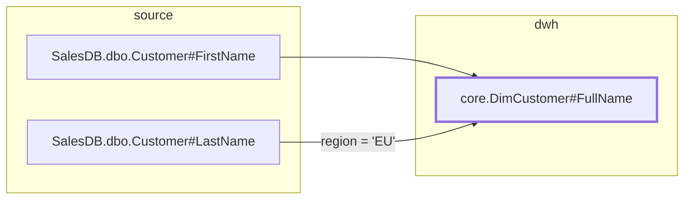

# EXP-02 — Mermaid render with `--focus` and `--depth`

**Epic:** Export · **Priority:** P2 · **Depends on:** LIN-01, LIN-02

## Story

**As a** data engineer
**I want** a Mermaid diagram of the lineage around a field
**So that** I can paste a picture into a PR, a design doc or Confluence without a UI existing.

## Acceptance criteria

**AC1 — focused render**
Given `mc render --format mermaid --focus dwh://core/DimCustomer#FullName --depth 2`
When it runs
Then a `flowchart LR` is emitted covering nodes within 2 hops in both directions.

**AC2 — direction control**
Given `--up-only` or `--down-only`
When supplied
Then only that direction is rendered.

**AC3 — layers as subgraphs**
Given nodes across layers
When rendered
Then each layer is a `subgraph` — source, dwh, mart — so the picture reads left to right by layer.

**AC4 — edge labels**
Given edges with conditions
When rendered
Then the condition is the edge label, truncated to a configurable length with an ellipsis.

**AC5 — asset-level mode**
Given `--level asset`
When supplied
Then tables are the nodes and column edges are collapsed into table edges with a count label — the readable view for anything non-trivial.

**AC6 — focus required beyond a threshold**
Given no `--focus` and a graph above the node threshold (default 150)
When it runs
Then it refuses with a message suggesting `--focus` or `--level asset`, rather than emitting an unreadable diagram.

**AC7 — identifier safety**
Given URNs containing `/`, `#`, `:` and `.`
When rendered
Then node ids are sanitized to `n1`, `n2`, … with the URN as the display label, so Mermaid never breaks on punctuation.

**AC8 — highlight the focus**
Given a focused render
When it prints
Then the focus node carries a distinct `classDef` style.

## Implementation notes

Output shape:

String building, no library. A dict of `urn -> nid` assigned in traversal order gives AC7 for free and keeps output deterministic.

AC6 is the difference between a feature and a novelty. At the stated scale (1k–10k columns) an unfocused column-level render is unreadable, and shipping one that technically works teaches people the command is useless. Refuse, and point at the two flags that help.

Node labels drop the URN scheme and host — `SalesDB.dbo.Customer#FirstName`, not the full URN — since the subgraph already conveys the layer. Full URNs make every node box enormous.

Escape `"` in labels; Mermaid is unforgiving there and the failure is a blank diagram with no error.

Graphviz/SVG output is out of scope for Phase 1. If diagrams become load-bearing, `--format dot` is a small addition against the same node/edge collection code — so keep rendering separate from graph collection.

## Verification

Render a 3-layer fixture focused at depth 2 → paste into a markdown preview, renders. Conditional edge → labelled. `--level asset` → collapsed with counts. Unfocused render over 150 nodes → refusal with advice. URN with punctuation → valid output. Render twice → identical text.
